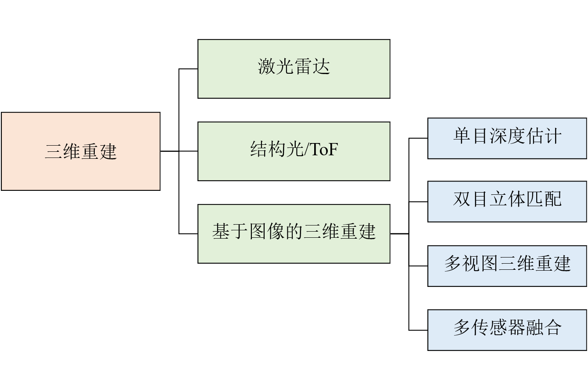
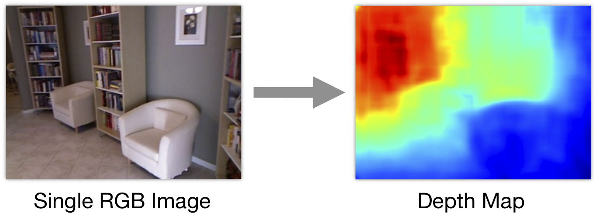
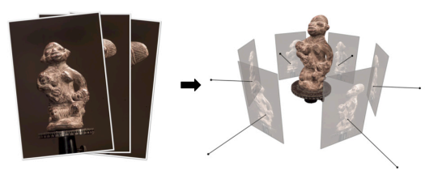
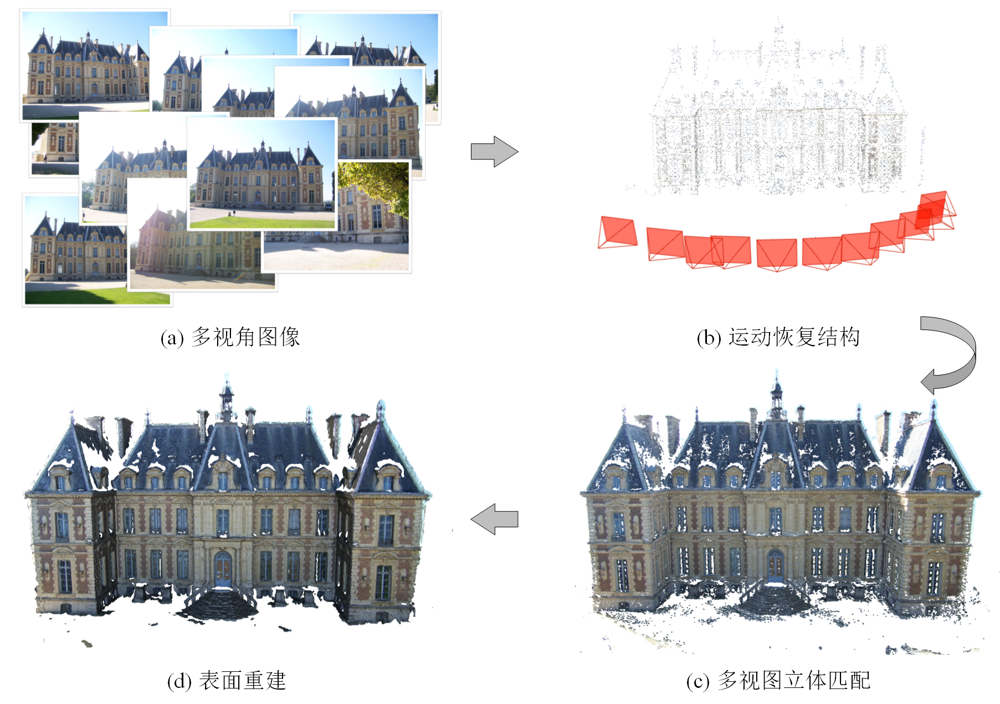
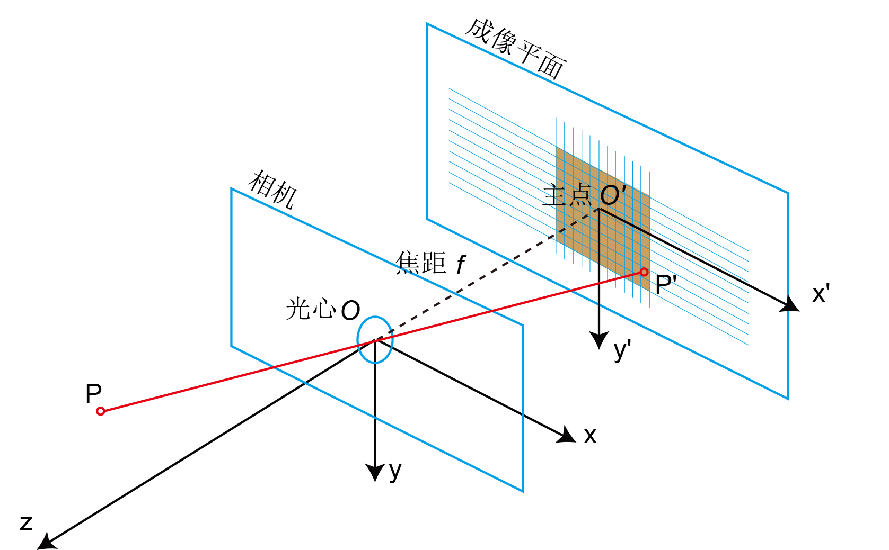
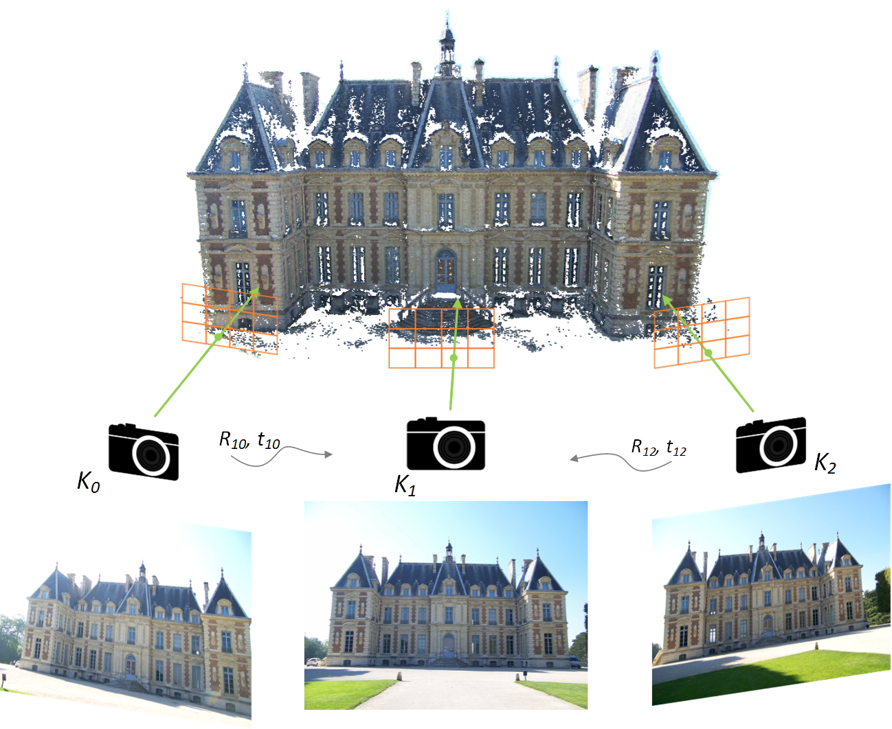
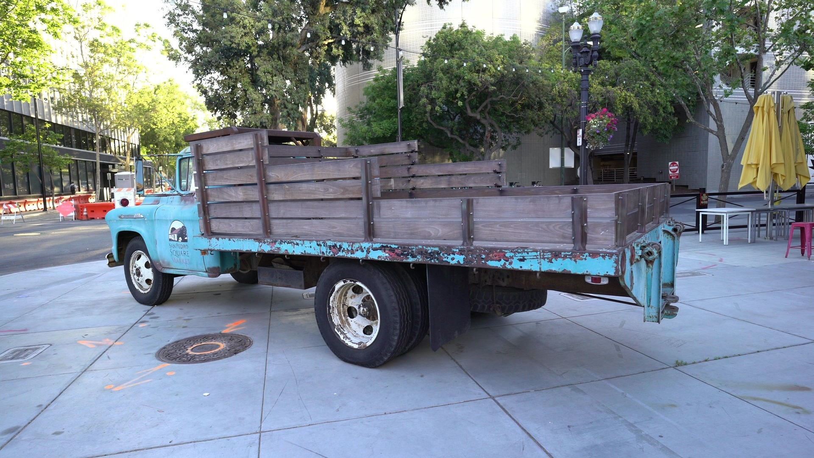
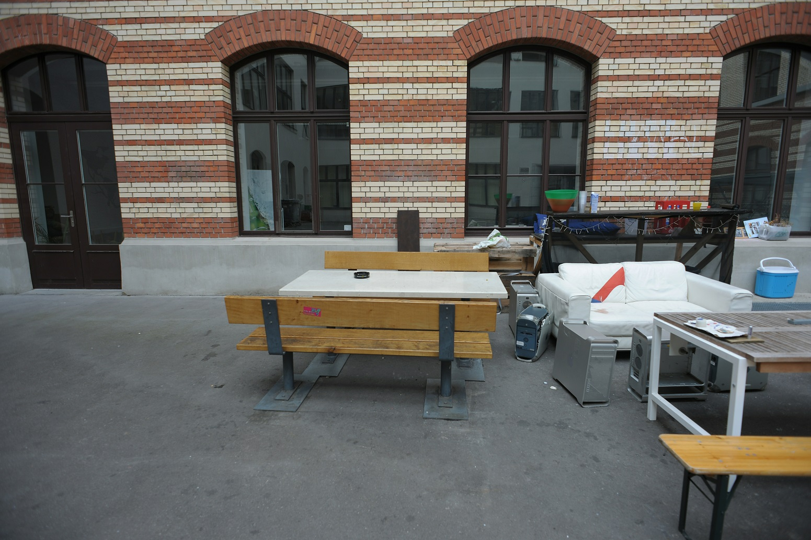
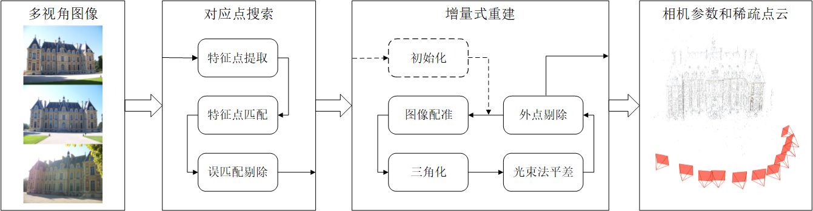

# multi-view-3d-reconstruction
《基于多视角图像的三维重建》

## 一、引言

### 1.1 三维重建

三维重建根据所用传感器的不同，可以分为**主动式三维重建**和**被动式三维重建**。主动式三维重建根据传感器去主动探测深度信息，常用的传感器包括激光雷达（LiDAR），结构光（Structured Light）和ToF（Time-of-Fight, 飞行时间）等。主动式三维重建适用的场景受限，而且通常硬件设备价格昂贵。而被动式三维重建通常只需要相机，而且适用场景较为广泛，因此受到研究人员的重视/青睐。被动式三维重建根据算法输入视图数目的不同，可以分为单目深度估计、双目立体匹配和多视图三维重建三种方式。

 <table align="center">
  <tr>
    <td></td>
  </tr>
  <tr>
    <td>三维重建方式分类</td>
  </tr>
</table>

+ 三维重建
  + 激光雷达  【准确/稀疏/场景受限/探测距离受限/贵】 --> 自动驾驶
  + 结构光/ToF 【快速出深度图/场景受限/探测距离受限/较贵】 --> KinectV1/V2、奥比中光、RealSense
  + 基于图像的三维重建 【成本低/算法性能在不断提升】
    + 单目深度估计
    + 双目立体匹配
    + 多视图三维重建

### 1.2 基于图像的三维重建

基于图像的三维重建根据输入视图数可分为：**单目深度估计**、**双目立体匹配**和**多视图三维重建**。具体到每一种方式，如果三维重建是以恢复场景几何结构为目标，那么单目深度估计的深度图如果没有施加多视图的几何一致性（连续性）约束的话，那么重建三维几何的质量无法保证；而双目立体匹配计算的深度和双目相机的焦距和基线有关，如果需要获得较大的深度感知范围，则需要很大的基线距离，因此限制了双目立体匹配的应用范围。多视图立体匹配的输入图像为多幅单目图像，通过多视图之间的相似性搜索进行深度图的预测。多视图立体匹配的图像无需进行校正， 图像采集成本低，适用范围广， 因此多视图立体匹配广泛应用于各种场景的三维模型重建中。

 <table align="center">
  <tr>
    <td></td>
    <td></td>    
    <td></td>
  </tr>
  <tr>
    <td>单目深度估计 (Eigen et al. 2014)</td>
    <td>双目立体匹配 (Middlebury Stereo Benchmark)</td>    
    <td>多视图三维重建 (MVS Tutorial)</td>
  </tr>
</table>

 + 单目深度估计
 + 双目立体匹配： `depth=f·b/disp`, 式中f为focal length(焦距)，b为baseline(基线)，深度探测范围受限于相机之间的基线距离
 + 多视图三维重建
 
 **QA: Stereo Matching和MVS的区别**

+ 数据获取：立体匹配通常使用双目相机进行拍摄，而MVS采集的数据通常为相机在不同视角下拍摄的多视角图像（或在连续视频流中采样得到的视频帧）
+ 输入视图数：顾名思义，立体匹配的输入为两幅（校正后的）图像，计算视差后通过相机基线 *b* 和焦距 *f*  将视差 *disparity* 转为深度值 *depth*
+ 更具体地，MVS的步骤中涉及视图选择，即选取哪些邻域视图用于相似性搜索（图像之间的夹角以及稀疏点之间的重叠度）。

### 1.3 基于多视角图像的三维重建
基于图像的三维重建系统的输入是一组具有重叠区域的多视角图像，首先通过**运动恢复结构**（Structure-fromMotion, SfM） 为输入图像进行相机位姿估计，同时得到场景的稀疏点云信息。然后**多视图立体匹配**算法（Multi-view Stereo, MVS） 用于稀疏重建的稠密化， 重建结果为场景的稠密点云模型。 如需获得三维场景的表面网格模型，则需要对重建得到的点云进行**表面重建**（Suface Reconstruction）。 

<!--
基于多视角图像进行三维重建的流程为：输入多视角采集的图像，输出对应场景的三维几何模型（点云/表面网格）。通常步骤包括：**输入图像采集**、**运动恢复结构**（Structure-from-Motion, SfM）、**多视图立体匹配**（Multi-view Stereo, MVS）和**表面重建**等步骤。
--->

 <table align="center">
  <tr>
    <td></td>
  </tr>
  <tr>
    <td>基于多视角图像的三维重建</td>
  </tr>
</table> 

+ 输入图像采集
  + 使用相机在不同视角下采集的图像
  + 从视频序列中采样得到的图像 https://github.com/cansik/sharp-frame-extractor
+ 运动恢复结构
+ 多视图立体匹配
+ 表面重建

### 1.4 多视图几何基础

 <table align="center">
  <tr>
    <td></td>
    <td></td>    
  </tr>
  <tr>
    <td>针孔相机模型（视觉SLAM十四讲）</td>
    <td>相机外参</td>    
  </tr>
</table>

## 二、数据集与评测指标
### 2.1 多视图三维重建数据集
#### 2.1.1 公开数据集
多视图三维重建（此处指MVS）常用数据集包括**DTU**、**Tanks and Temples**和**ETH3D**，以及用于深度学习网络模型训练的**BlendedMVS**。具体内容可以参考[multi-view-stereo-benchmark](https://github.com/XYZ-qiyh/Awesome-Learning-MVS#multi-view-stereo-benchmark)
<!--
+ DTU
+ Tanks and Temples
+ ETH3D
+ BlendedMVS
--->

 <table align="center">
  <tr>
    <td></td>
    <td></td>    
    <td></td>
  </tr>
  <tr>
    <td>DTU (scan83)</td>
    <td>Tanks and Temples (Truck)</td>    
    <td>ETH3D (courtyard)</td>
  </tr>
</table>

#### 2.1.2 多视图三维重建评测指标
为了评价三维点云重建的性能，使用F-score或平均绝对误差距离指标来定性评价重建结果的准确性和完整性。
+ F-score的计算可以参考 [Tanks and Temples Tutorial](https://tanksandtemples.org/tutorial/) (Appendix B. Compute F-score)
+ Overall Score的计算可参考 [Yao et al MVSNet paper](https://openaccess.thecvf.com/content_ECCV_2018/papers/Yao_Yao_MVSNet_Depth_Inference_ECCV_2018_paper.pdf) (Sec 5.1 Benchmarking on DTU dataset)

### 2.2 真实场景中的三维重建
数据分类：室内物体、室内场景、室外物体、室外场景

对于物体类型的重建，推荐使用基于深度学习的**PlaneSweeping**方法；而对于大规模场景的重建，传统**PatchMatch**方法的泛化性更佳

https://github.com/ethan-li-coding/Datasets-of-MVS-reconstruction

https://github.com/XYZ-qiyh/Awesome-Learning-MVS#large-scale-real-world-scenes

## 三、运动恢复结构

作为多视图立体匹配的前置步骤，运动恢复结构为输入图像进行**相机参数估计**和**场景稀疏重建**。稀疏重建得到的3D点记为χ={X_k∈R^3 |k=1...N_X}，N_X为场景稀疏点个数。运动恢复结构算法可以被划分为增量式和全局式方法，增量式的方法速度相较于全局式方法速度慢但准确性高，而全局式的方法对外点不够鲁棒。以增量式运动恢复结构为例，其重建流程如下图所示。

 <table align="center">
  <tr>
    <td></td>
  </tr>
  <tr>
    <td>增量式SfM重建流程</td>
  </tr>
</table>

增量式SfM首先从输入图像的特征点提取开始，由于SIFT特征具有尺度和几何不变性等特点，因此通常使用SIFT描述符来匹配不同图像之间的特征点，生成若干组可能的匹配点对。然后使用随机采样一致性（RANdom SAmple Consensus，RANSAC）策略来鲁棒地估计图像对之间的本质矩阵(Essential Matrix)，并剔除错误的匹配点对。在增量式重建阶段，从精心选取的两视图重建开始，通过图像配准和三角化不断地添加新视图和3D点。如果不进一步细化，SfM通常会迅速漂移到不可恢复的状态。考虑到过程中的误差累积，使用光束法平差（Bundle Adjustment, BA）对相机位姿和稀疏点位置进行优化，来最小化稀疏3D点在不同视角图像中的重投影误差。

<!--
Python版本Bundle Adjustment

https://scipy-cookbook.readthedocs.io/items/bundle_adjustment.html

+ 论文：[Structure-from-Motion Revisited](https://openaccess.thecvf.com/content_cvpr_2016/papers/Schonberger_Structure-From-Motion_Revisited_CVPR_2016_paper.pdf)

+ 代码：[colmap/colmap: COLMAP - Structure-from-Motion and Multi-View Stereo (github.com)](https://github.com/colmap/colmap)

+ 博客：[三维重建系列之COLMAP: Structure-from-Motion Revisited](https://mp.weixin.qq.com/s/L8xABwv5O5i9-2u2UZKRZg)

+ 图解：[Structure-from-Motion](./SfM/Structure-from-Motion.pdf) (节选自pixel-perfect-sfm)

### 特征点提取与匹配

基于稀疏特征点的方法是SLAM或VIO技术的标准，因为他们速度快、精度高。 “先检测再描述”是最常见的稀疏特征提取方法，具体地，首先检测特征点，然后对该特征点周围的块进行描述。描述子封装了更高级别的信息，这些信息被低级别的关键点所忽略。在深度学习之前，SIFT和ORB特征点被广泛用于低级别视觉任务的特征匹配描述子。而随着深度学习的出现，在很多的应用中取代了这些手工设计的特征。近年来，出现了SuperPoint、LIFT和GIFT等相关工作。

常见的特征点：
+ SIFT 
+ ORB
+ SuperPoint: Self-Supervised Interest Point Detection and Description [[paper](https://openaccess.thecvf.com/content_cvpr_2018_workshops/papers/w9/DeTone_SuperPoint_Self-Supervised_Interest_CVPR_2018_paper.pdf)] [[Github](https://github.com/rpautrat/SuperPoint)]
[[PythonSIFT](https://github.com/rmislam/PythonSIFT)] [Tutorial](https://www.aishack.in/tutorials/sift-scale-invariant-feature-transform-introduction/) [Code](https://github.com/aishack/sift/blob/master/SIFT.h) [Code2](https://github.com/Daksh-404/sift)
[[blog](https://saraswathimamidala30.medium.com/superpoint-self-supervised-interest-point-detection-and-description-7d6b7b0ccf57)] https://vincentqin.tech/posts/superpoint/

### 图像配准
Starting from a metric reconstruction, new images can be registered to the current model by solving the Perspective-n-Point (PnP) problem [18] using feature correspondences to triangulated points in already registered images (2D-3D correspondences).

PnP（Perspective-n-Point）是求解 3D 到 2D 点对运动的方法。它描述了当我们知道n 个 3D 空间点以及它们的投影位置时，如何估计相机所在的位姿。

### QA：SfM与vSLAM的区别与联系

--->

## 四、多视图立体匹配
基于深度学习的MVS方法汇总：https://github.com/XYZ-qiyh/Awesome-Learning-MVS

基于传统PatchMatch的多视图三维重建：https://github.com/XYZ-qiyh/Awesome-PatchMatch-MVS

<!--
## 五、表面重建

基于PoissonRecon的表面重建：https://www.cnblogs.com/Todd-Qi/p/14382577.html

## 六、深度图渲染
TODO
--->

  
 多视图三维重建交流群 

  添加本人VX: darknet_6688, 拉你进群（群成员超过200人后无法通过扫码进群）

  
